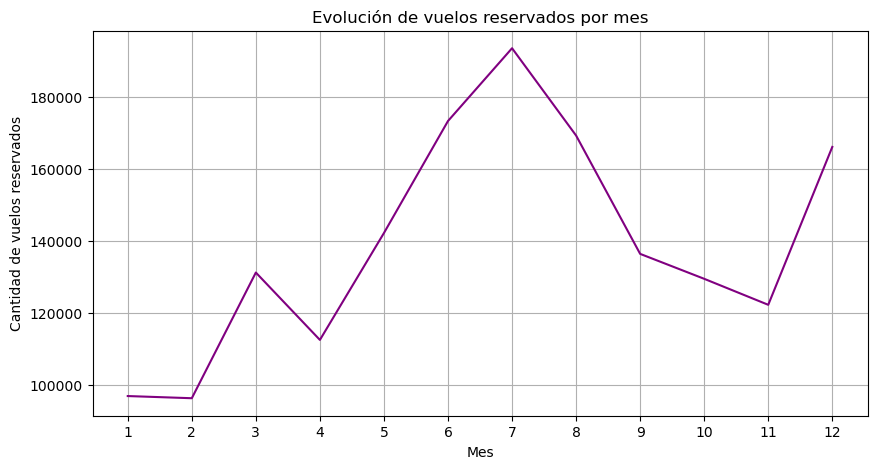
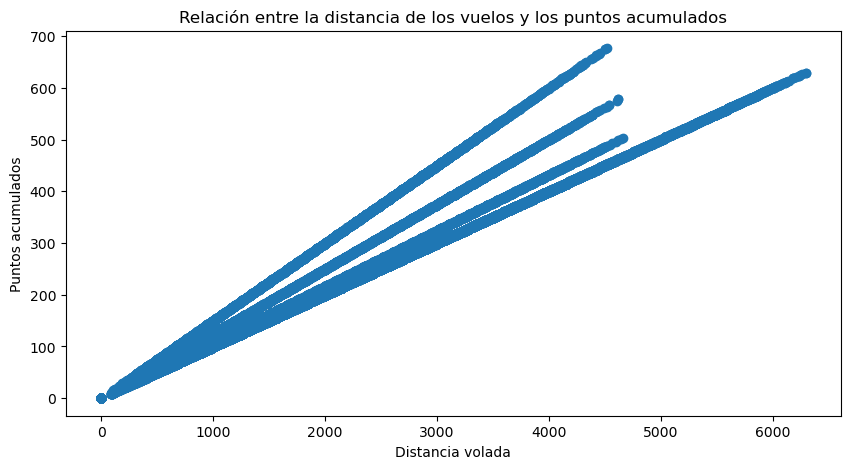
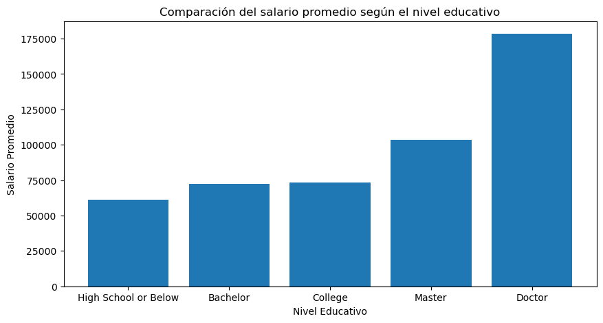
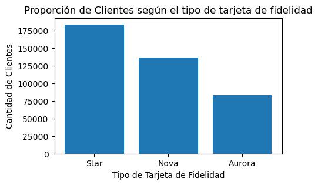
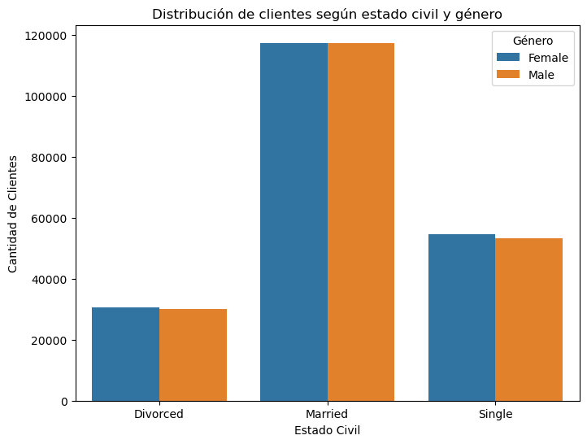

# Proyecto: Evaluación Final - Modulo 3
 ## ¿Cómo acceder al ejercicio?

- Clonar el repositorio: git clone '[URL del repositorio](https://github.com/Adalab/bda-modulo-3-evaluacion-final-AlbaToro.git)'

- Descargar los archivos csv.

- Ejecutar el código.

# Fases:

## Fase 1: Exploración y Limpieza
- Exploración Inicial:
Realiza una exploración inicial de los datos para identificar posibles problemas, como valores
nulos, atípicos o datos faltantes en las columnas relevantes.
Utiliza funciones de Pandas para obtener información sobre la estructura de los datos, la
presencia de valores nulos y estadísticas básicas de las columnas involucradas.
Une los dos conjuntos de datos de la forma más eficiente.
- Limpieza de Datos:
Elimina o trata los valores nulos, si los hay, en las columnas clave para asegurar que los datos
estén completos.
Verifica la consistencia y corrección de los datos para asegurarte de que los datos se
presenten de forma coherente.
Realiza cualquier ajuste o conversión necesaria en las columnas (por ejemplo, cambiar tipos de
datos) para garantizar la adecuación de los datos para el análisis estadístico.

## Fase 2: Visualización
Usando las herramientas de visualización que has aprendido durante este módulo, contesta a las siguientes
gráficas usando la mejor gráfica que consideres:
- ¿Cómo se distribuye la cantidad de vuelos reservados por mes durante el año?

- ¿Existe una relación entre la distancia de los vuelos y los puntos acumulados por los cliente?

- ¿Cuál es la distribución de los clientes por provincia o estado?

- ¿Cómo se compara el salario promedio entre los diferentes niveles educativos de los clientes?

- ¿Cuál es la proporción de clientes con diferentes tipos de tarjetas de fidelidad?

- ¿Cómo se distribuyen los clientes según su estado civil y género?

# Ejercicio realizado por:
Alba Toro Veiga (ANecora)